# LYTE Program Flow Chart

This document contains Mermaid flowcharts that outline the flow of the entire LYTE application.

## Main Application Flow

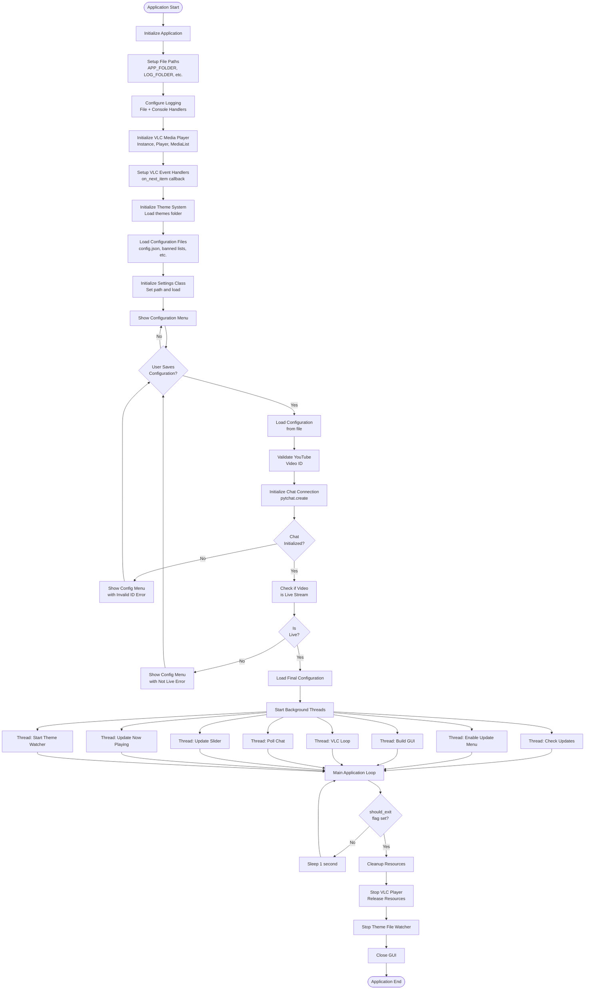

## Chat Message Processing Flow

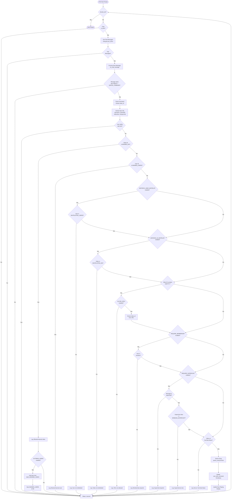

## Song Queue Flow

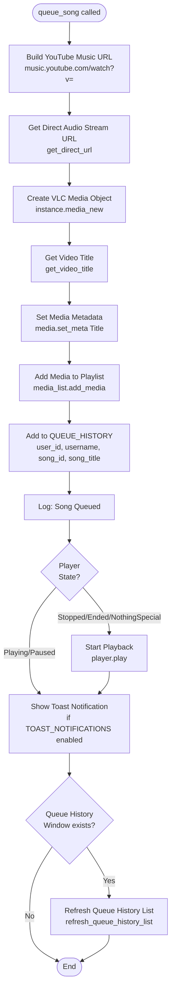

## VLC Playback Flow

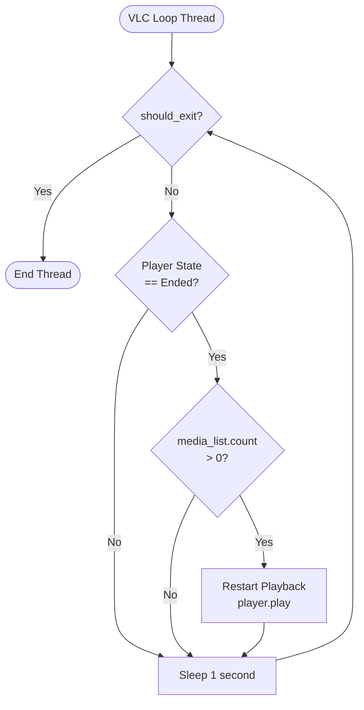

## VLC Event Handler Flow

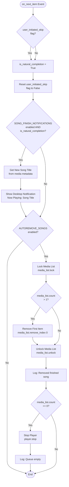

## GUI Update Threads Flow

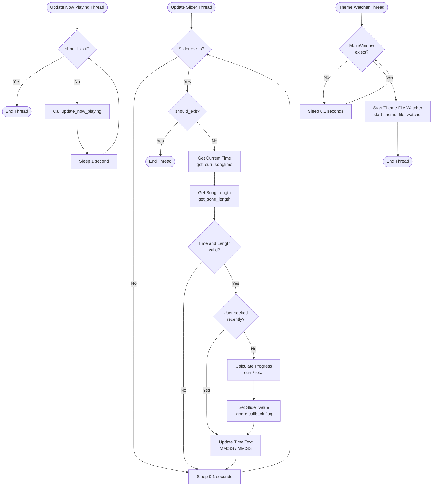

## Configuration Menu Flow

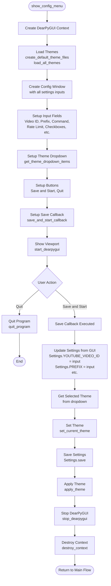

## Settings Save Flow

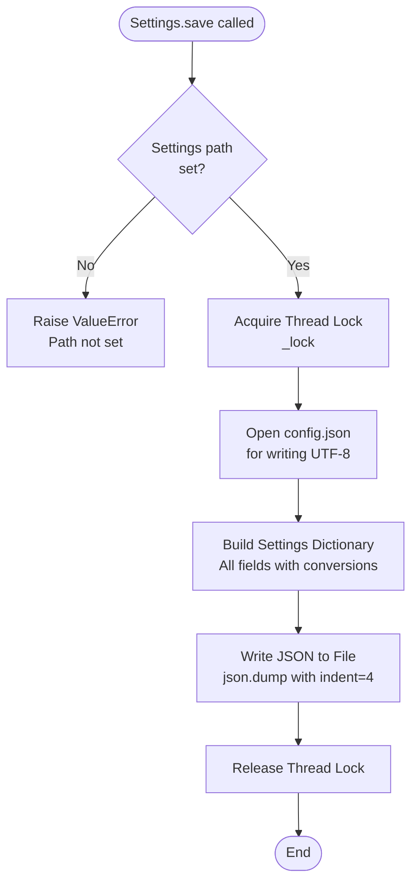

## Theme File Watcher Flow

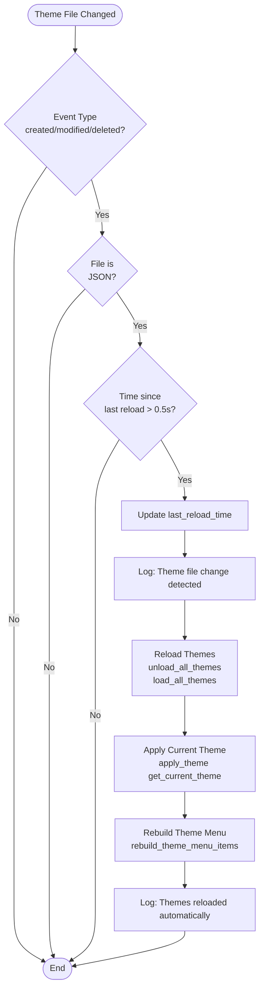

## Update Check Flow

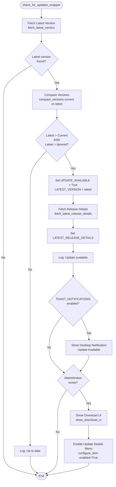

## Ban/Unban Flow

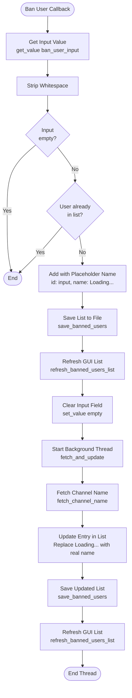

## GUI Build Flow

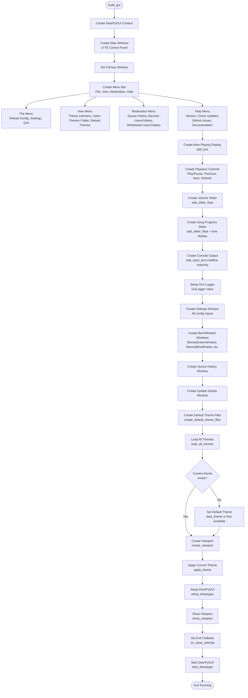

---

## Legend

- **Rectangles**: Process/Function
- **Diamonds**: Decision/Condition
- **Ovals**: Start/End points
- **Parallelograms**: Input/Output
- **Arrows**: Flow direction

## Thread Overview

The application runs multiple background threads:

1. **Check Updates Thread**: Periodically checks for updates
2. **Enable Update Menu Thread**: Enables update menu when update available
3. **Build GUI Thread**: Builds and displays the GUI
4. **VLC Loop Thread**: Monitors VLC player state
5. **Poll Chat Thread**: Continuously polls YouTube chat for messages
6. **Update Slider Thread**: Updates song progress slider in real-time
7. **Update Now Playing Thread**: Updates "Now Playing" display periodically
8. **Theme Watcher Thread**: Starts theme file watcher after GUI ready

All threads run as daemon threads and check the `should_exit` flag for graceful shutdown.

